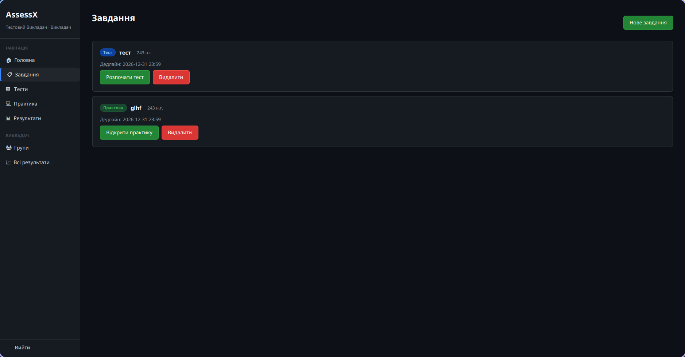
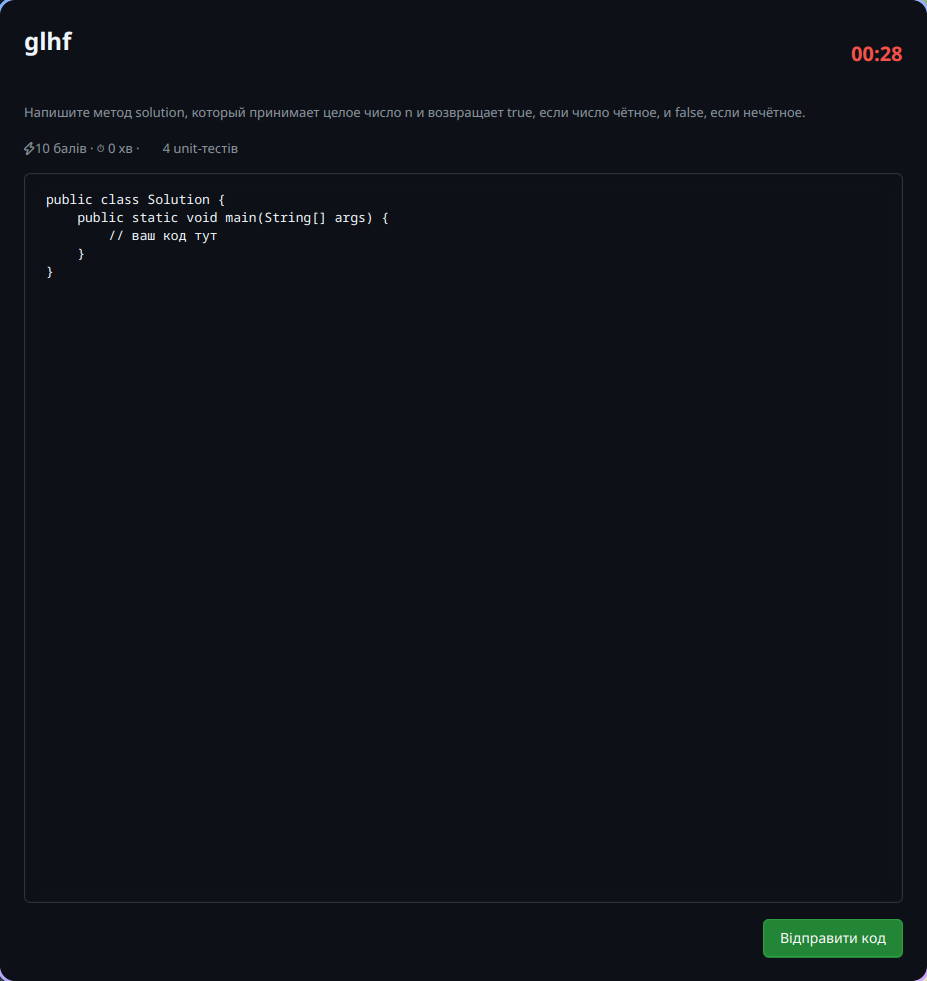
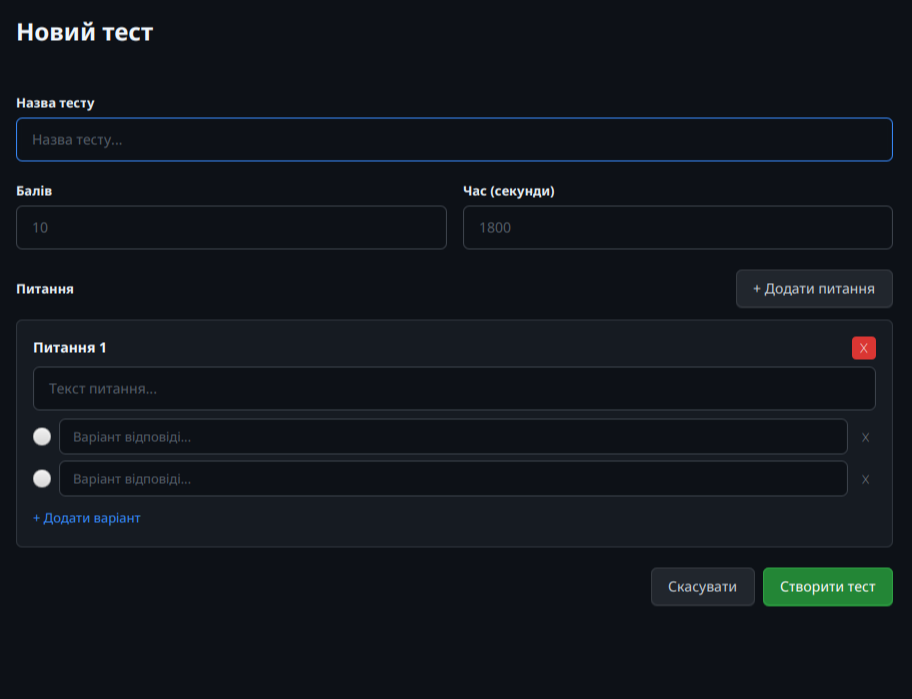
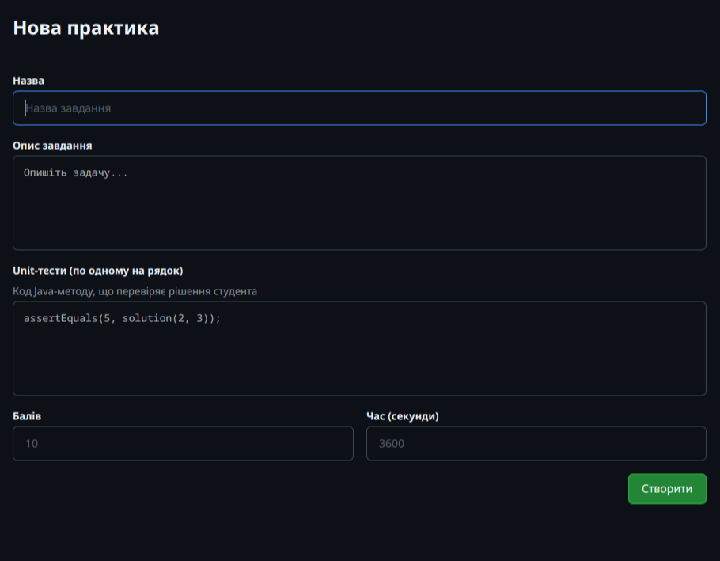

<div align="center">
  <h1>🎓 AssessX</h1>
  <p><strong>Система оцінювання студентів — тести, практичні завдання з кодом та автоматична перевірка</strong></p>

  
  
  
  
  
  
  

</div>

---

## 📋 Зміст

- [Про проєкт](#-про-проєкт)
- [Можливості](#-можливості)
- [Скріншоти](#-скріншоти)
- [Стек технологій](#-стек-технологій)
- [Швидкий старт](#-швидкий-старт)
- [API](#-api)

---

## 🧠 Про проєкт

**AssessX** — десктопна система для оцінювання студентів із поділом на ролі **Викладач** / **Студент**.

Викладач створює тести та практичні завдання з кодом, призначає їх групам студентів із дедлайнами. Студент виконує завдання в реальному часі: проходить тести з таймером або пише код, який автоматично перевіряється unit-тестами в ізольованому середовищі.

---

## ✨ Можливості

### 👨‍🏫 Викладач
- Створення тестів (питання з варіантами відповідей)
- Створення практичних завдань з кодом + unit-тести
- Призначення завдань конкретним групам із дедлайнами
- Перегляд результатів студентів по групах
- Видалення тестів, практик і завдань (каскадне очищення даних)

### 👨‍🎓 Студент
- Перегляд призначених завдань із дедлайнами
- Проходження тестів з таймером зворотного відліку
- Написання коду в редакторі з підсвічуванням синтаксису
- Автоматична перевірка через unit-тести
- Перегляд власних результатів і спроб

### 🔒 Авторизація
- OAuth2 через GitHub
- JWT-токени
- Розмежування доступу за роллю (TEACHER / STUDENT)

---

## 📸 Скріншоти

### Сторінка завдань (студент)


### Практичне завдання з кодом


### Панель викладача — тести


### Панель викладача — практика


---

**Потік даних:**

```
JavaFX Client → HTTP (JWT) → Spring Boot API → PostgreSQL
                                    ↓
                          Docker (code-runner) ← unit-тести
```

---

## 🛠 Стек технологій

| Компонент | Технологія |
|-----------|-----------|
| Backend | Spring Boot 4.0.4, Spring Security 7, Spring Data JPA |
| ORM | Hibernate 7.2.7 |
| БД | PostgreSQL 15 |
| Авторизація | OAuth2 GitHub, JWT (Nimbus JOSE) |
| Frontend | JavaFX (десктоп), NextJS (веб) |
| JSON | Jackson 3.x (tools.jackson) |
| Виконання коду | Docker-контейнер з ізольованим JVM |
| Збірка | Maven, Docker Compose |
| Тести | JUnit 6, Mockito 5 |

---

## 🚀 Швидкий старт

### Вимоги

- Docker & Docker Compose
- Java 21+
- Maven 3.9+

### Запуск через Docker Compose

```bash
git clone https://github.com/fxhxyz4/AssessX-backend.git
cd AssessX-backend

cp .env.example .env

docker compose -f docker-compose.dev.yml up --build
```

Бекенд запуститься на `http://localhost:8080`.

### Запуск JavaFX клієнта

```bash
cd AssessX
mvn javafx:run
```

### Змінні середовища для backend

| Змінна | Опис |
|--------|------|
| `GITHUB_CLIENT_ID` | GitHub OAuth App Client ID |
| `GITHUB_CLIENT_SECRET` | GitHub OAuth App Client Secret |
| `JWT_SECRET` | Секрет для підпису JWT токенів |
| `PORT` | Backend порт |
| `DB_NAME` | Назва БД |
| `DB_PORT` | БД порт |
| `DB_URL` | JDBC URL до PostgreSQL |
| `DB_USER` | Користувач БД |
| `DB_PASS` | Пароль БД |

---

### Змінні середовища для frontend
| Змінна | Опис |
|--------|------|
| `API_PORT` | Backend порт |
| `API_URL` | Ссылка на backend  |

---

## 🔌 API

### Авторизація
| Метод | Endpoint | Опис |
|-------|----------|------|
| GET | `/oauth2/authorization/github` | Редирект на GitHub OAuth |
| GET | `/api/auth/me` | Поточний користувач |

### Тести
| Метод | Endpoint | Опис |
|-------|----------|------|
| GET | `/api/tests` | Список тестів |
| POST | `/api/tests` | Створити тест |
| GET | `/api/tests/{id}` | Отримати тест |
| PUT | `/api/tests/{id}` | Оновити тест |
| DELETE | `/api/tests/{id}` | Видалити тест |
| POST | `/api/tests/{id}/submit` | Здати тест |

### Практика
| Метод | Endpoint | Опис |
|-------|----------|------|
| GET | `/api/practices` | Список практик |
| POST | `/api/practices` | Створити практику |
| DELETE | `/api/practices/{id}` | Видалити практику |
| POST | `/api/practices/{id}/submit` | Здати практику |

### Завдання
| Метод | Endpoint | Опис |
|-------|----------|------|
| GET | `/api/assignments` | Всі завдання |
| GET | `/api/assignments/my` | Завдання студента |
| POST | `/api/assignments` | Призначити завдання |
| DELETE | `/api/assignments/{id}` | Видалити завдання |

### Результати
| Метод | Endpoint | Опис |
|-------|----------|------|
| GET | `/api/results/my` | Мої результати |
| GET | `/api/results/group/{id}` | Результати групи |

---

<div align="center">
  <sub>License: MPL-2.0</sub>
</div>
